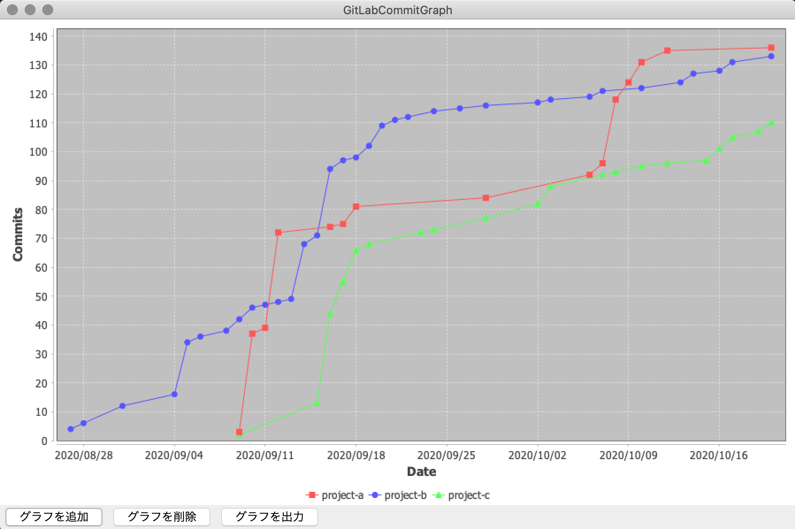
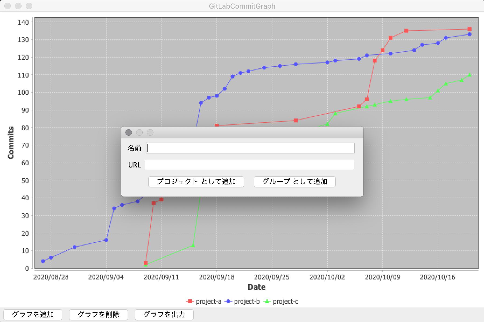
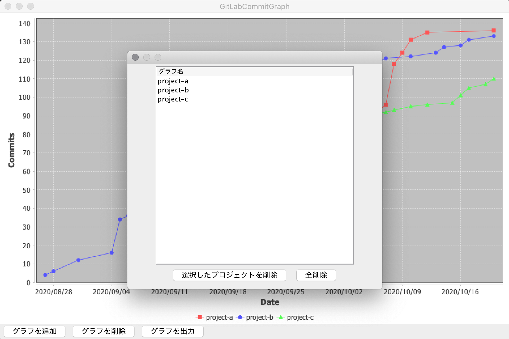
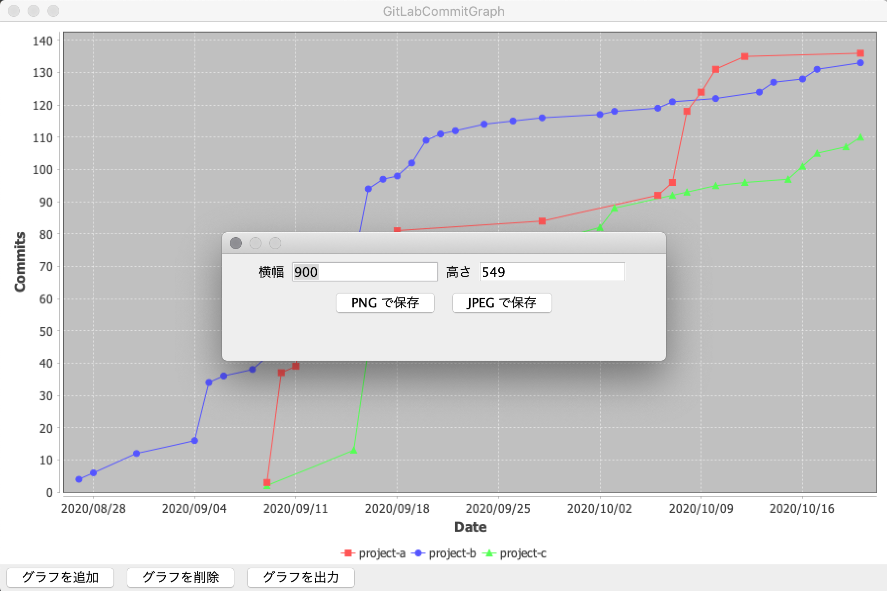
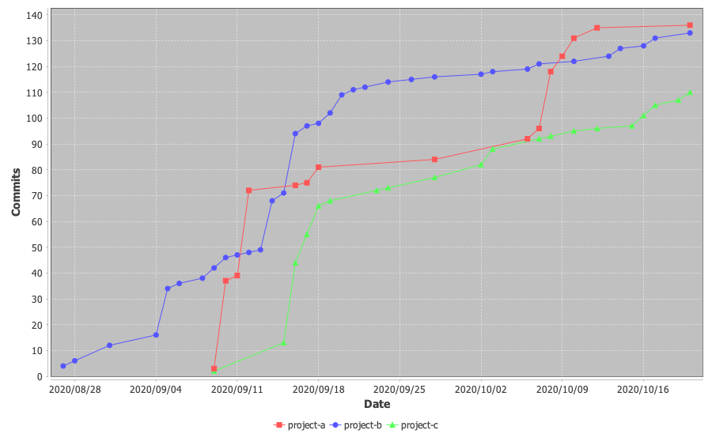

# GitLabCommitGraph
GitLab のコミット状況をグラフで確認できます。  
グループ・プロジェクト単位で複数比較することが可能です。

## スクリーンショット

### ウィンドウ例

### グラフの画像出力

## 依存関係
| 名前                | バージョン  |
|:------------------:|:---------:|
| Gson               | 2.8.6     |
| Ktor Client OkHttp | 1.4.1     |
| JFreeChart         | 1.5.0     |

## リリース
-  v1.0.0 \[latest\] (2020/10/20)